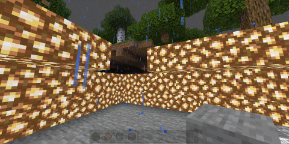
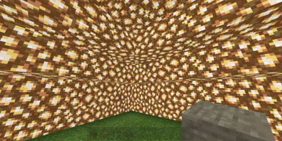

# Programming Minecraft with Websockets

Minecraft lets you connect to a websocket server when you're in a game. The server can receive and send any commands. This lets you build a bot that you can ... (well, I don't know what it can do, let's explore.)

Minecraft has [commands](https://minecraft.gamepedia.com/Commands) you can type on a chat window. For example, type `/` to start a command and type `setblock ~1 ~0 ~0 grass` changes the block 1 north of you into grass. (`~` means relative to you. Coordinates are specified as X, Y and Z.)


- [Programming Minecraft with Websockets](#programming-minecraft-with-websockets)
  - [Connect to Minecraft](#connect-to-minecraft)
  - [Subscribe to chat messages](#subscribe-to-chat-messages)
  - [Build structures using chat](#build-structures-using-chat)
  - [Understand Minecraft's responses](#understand-minecrafts-responses)
  - [Wait for commands to be done](#wait-for-commands-to-be-done)

Note:

- These instructions were tested on Minecraft Bedrock 1.16. I haven't tested them on the Java Edition.

## Connect to Minecraft

You can send any command to Minecraft from a websocket server. Let's use JavaScript for this.

First, run `npm install ws uuid`. (We need [`ws`](https://npmjs.com/package/ws) for websockets and [`uuid`](https://npmjs.com/package/uuid) to generate unique IDs.)

Then create this [`mineserver1.js`](mineserver1.js):

```js
const WebSocket = require('ws')
const uuid = require('uuid')        // For later use

// Create a new websocket server on port 3000
console.log('Ready. On MineCraft chat, type /connect localhost:3000')
const wss = new WebSocket.Server({ port: 3000 })

// On Minecraft, when you type "/connect localhost:3000" it creates a connection
wss.on('connection', socket => {
  console.log('Connected')
})
```

Run `node mineserver1.js`. Then type `/connect localhost:3000` in a Minecraft chat window. You'll see 2 things:

1. MineCraft says "Connection established to server: ws://localhost:3000"
2. Node prints "Connected"

Now, our program is connected to Minecraft, and can send/receive messages.


Notes:

- The Python equivalent is in [mineserver1.py](mineserver1.py). Run `python mineserver1.py`.
- If you get an `Uncaught Error: Cannot find module 'ws'`, make sure you ran `npm install ws uuid`.
- To disconnect, run `/connect off`.

## Subscribe to chat messages

Now let's listen to the players' chat.

A connected websocket server can send a "subscribe" message to Minecraft saying it wants to
"listen" to specific actions. For example, you can subscribe to "PlayerMessage". Whenever a player
sents a chat message, Minecraft will notify the websocket client.

Here's how to do that. Add this code in the `wss.on('connection', socket => { ... })` function.

```js
  // Tell Minecraft to send all chat messages. Required once after Minecraft starts
  socket.send(JSON.stringify({
    "header": {
      "version": 1,                     // We're using the version 1 message protocol
      "requestId": uuid.v4(),           // A unique ID for the request
      "messageType": "commandRequest",  // This is a request ...
      "messagePurpose": "subscribe"     // ... to subscribe to ...
    },
    "body": {
      "eventName": "PlayerMessage"      // ... all player messages.
    },
  }))
```

Now, every time a player types something in the chat window, the socket will receive it. Add this
code below the above code:

```js
  // When MineCraft sends a message (e.g. on player chat), print it.
  socket.on('message', packet => {
    const msg = JSON.parse(packet)
    console.log(msg)
  })
```

This code parses all the messages it receives and prints them.

This code in is [`mineserver2.js`](mineserver2.js). Run `node mineserver2.js`.
Then type `/connect localhost:3000` in a Minecraft chat window.
Then type a message (e.g. "alpha") in the chat window.
You'll see a message like this in the console.

```js
{
  header: {
    messagePurpose: 'event',        // This is an event
    requestId: '00000000-0000-0000-0000-000000000000',
    version: 1                      // using version 1 message protocol
  },
  body: {
    eventName: 'PlayerMessage',
    measurements: null,
    properties: {
      AccountType: 1,
      ActiveSessionID: 'e0afde71-9a15-401b-ba38-82c64a94048d',
      AppSessionID: 'b2f5dddc-2a2d-4ec1-bf7b-578038967f9a',
      Biome: 1,                     // Plains Biome. https://minecraft.gamepedia.com/Biome
      Build: '1.16.201',            // That's my build
      BuildNum: '5131175',
      BuildPlat: 7,
      Cheevos: false,
      ClientId: 'fcaa9859-0921-348e-bc7c-1c91b72ccec1',
      CurrentNumDevices: 1,
      DeviceSessionId: 'b2f5dddc-2a2d-4ec1-bf7b-578038967f9a',
      Difficulty: 'NORMAL',         // I'm playing on normal difficulty
      Dim: 0,
      GlobalMultiplayerCorrelationId: '91967b8c-01c6-4708-8a31-f111ddaa8174',
      Message: 'alpha',             // This is the message I typed
      MessageType: 'chat',          // It's of type chat
      Mode: 1,
      NetworkType: 0,
      Plat: 'Win 10.0.19041.1',
      PlayerGameMode: 1,            // Creative. https://minecraft.gamepedia.com/Commands/gamemode
      Sender: 'Anand',              // That's me.
      Seq: 497,
      WorldFeature: 0,
      WorldSessionId: '8c9b4d3b-7118-4324-ba32-c357c709d682',
      editionType: 'win10',
      isTrial: 0,
      locale: 'en_IN',
      vrMode: false
    }
  }
}
```

Notes:

- The Python equivalent is in [mineserver2.py](mineserver2.py). Run `python mineserver2.py`.
- The official Minecraft docs say that the [MCWSS protocol is outdated](https://minecraft.gamepedia.com/Commands/wsserver#Uses).
  But it seems to work.
- The full list of things we can subscribe to is undocumented, but
  [@jocopa3](https://gist.github.com/jocopa3/) has reverse-engineered a
  [list of messages](https://gist.github.com/jocopa3/5f718f4198f1ea91a37e3a9da468675c)
  we can subscribe to, and they're somewhat meaningful.
- [This Go package](https://github.com/Sandertv/mcwss/) has code that explores the
  [protocol](https://github.com/Sandertv/mcwss/tree/master/protocol) further.
- This [chat](https://www.reddit.com/r/MCPE/comments/5ta719/mcpewin10_global_chat_using_websockets/)
  has more details. There's also an
  [outdated list of JSON messages](https://gist.github.com/jocopa3/54b42fb6361952997c4a6e38945e306f)
  from [@jocopa3](https://gist.github.com/jocopa3/).
- Here's a sample program that
  [places a block in Minecraft](https://gist.github.com/pirosuke/1ca2aa4d8920f41dfbabcbc7dc2a669f)

## Build structures using chat

Let's create a pyramid of size `10` around us when we type `pyramid 10` in the chat window.

The first step is to check if the player sent a chat message like `pyramid 10` (or another number).
Add this code below the above code:

```js
  // When MineCraft sends a message (e.g. on player chat), act on it.
  socket.on('message', packet => {
    const msg = JSON.parse(packet)
    // If this is a chat window
    if (msg.body.eventName === 'PlayerMessage') {
      // ... and it's like "pyramid 10" (or some number), draw a pyramid
      const match = msg.body.properties.Message.match(/^pyramid (\d+)/i)
      if (match)
        draw_pyramid(+match[1])
    }
  })
```

If the user types "pyramid 3" on the chat window, `draw_pyramid(3)` is called.

In `draw_pyramid()`, let's send commands to build a pyramid. To send a command, we need to create a
JSON with the command (e.g. `setblock ~1 ~0 ~0 grass`). Add this code below the above code:

```js
  function send(cmd) {
    const msg = JSON.stringify({
      "header": {
        "version": 1,
        "requestId": uuid.v4(),     // Send unique ID each time
        "messagePurpose": "commandRequest",
        "messageType": "commandRequest"
      },
      "body": {
        "version": 1,               // TODO: Needed?
        "commandLine": cmd,         // Define the command
        "origin": {
          "type": "player"          // Message comes from player
        }
      }
    })
    socket.send(msg)                // Send the JSON string
  }
```

Let's write `draw_pyramid()` to create a pyramid using glowstone by adding this code below the
above code:

```js
  // Draw a pyramid of size "size" around the player.
  function draw_pyramid(size) {
    // y is the height of the pyramid. Start with y=0, and keep building up
    for (let y = 0; y < size + 1; y++) {
      // At the specified y, place blocks in a rectangle of size "side"
      let side = size - y;
      for (let x = -side; x < side + 1; x++) {
        send(`setblock ~${x} ~${y} ~${-side} glowstone`)
        send(`setblock ~${x} ~${y} ~${+side} glowstone`)
        send(`setblock ~${-side} ~${y} ~${x} glowstone`)
        send(`setblock ~${+side} ~${y} ~${x} glowstone`)
      }
    }
  }
```

This code in is [`mineserver3.js`](mineserver3.js).

- Run `node mineserver3.js`.
- Then type `/connect localhost:3000` in a Minecraft chat window.
- Then type `pyramid 3` in the chat window.
- You'll be surrounded by a glowstone pyramid.


Notes:

- The Python equivalent is in [mineserver3.py](mineserver3.py). Run `python mineserver3.py`.
- The "requestId" needs to be a UUID -- at least for block commands. I tried unique "requestId"
  values like 1, 2, 3 etc. That didn't work.

## Understand Minecraft's responses

For every command you send, Minecraft sends a response. It's "header" looks like this:

```jsonc
{
  "header": {
    "version": 1,
    "messagePurpose": "commandResponse",                  // Response to your command
    "requestId": "97dee9a3-a716-4caa-aef9-ddbd642f2650"   // ... and your requestId
  }
}
```

If the command is successful, the response has `body.statusCode == 0`. For example:

```jsonc
{
  "body": {
    "statusCode": 0,                  // No error
    "statusMessage": "Block placed",  // It placed the block you wanted
    "position": { "x": 0, "y": 64, "z": 0 }   // ... at this location
  },
}
```

If the command failed, the response has a negative `body.statusCode`. For example:

```jsonc
{
  "body": {
    "statusCode": -2147352576,        // This is an error
    "statusMessage": "The block couldn't be placed"
  },
}
```

To print these, add this to `socket.on('message', ...)`:

```js
    // If we get a command response, print it
    if (msg.header.messagePurpose == 'commandResponse')
      console.log(msg)
```

This code in is [`mineserver4.js`](mineserver4.js).

- Run `node mineserver4.js`.
- Then type `/connect localhost:3000` in a Minecraft chat window.
- Then type `pyramid 3` in the chat window.
- You'll be surrounded by a glowstone pyramid, and the *console will show every command response*.

Notes on common error messages:

- `The block couldn't be placed` (-2147352576):
  The same block was already at that location.
- `Syntax error: Unexpected "xxx": at "~0 ~9 ~-1 >>xxx<<"` (-2147483648):
  You gave wrong arguments to the command.
- `Too many commands have been requested, wait for one to be done` (-2147418109):
  Minecraft only allows 100 commands can be executed without waiting for their response.
- [More error messages here](https://github.com/CloudburstMC/Language/blob/master/en_GB.lang).

## Wait for commands to be done

Typing "pyramid 3" works just fine. But try "pyramid 5" and your pyramid is incomplete.



That's because Minecraft only allows up to 100 messages in its queue. On the 101st message, you get
a `Too many commands have been requested, wait for one to be done` error.

```json
{
  "header": {
    "version": 1,
    "messagePurpose": "error",
    "requestId": "a5051664-e9f4-4f9f-96b8-a56b5783117b"
  },
  "body": {
    "statusCode": -2147418109,
    "statusMessage": "Too many commands have been requested, wait for one to be done"
  }
}
```

So let's modify `send()` to add to a queue and send in batches. We'll create two queues:

```js
  const sendQueue = []        // Queue of commands to be sent
  const awaitedQueue = {}     // Queue of responses awaited from Minecraft
```

In `wss.on('connection', ...)`, when Minecraft completes a command, we'll remove it from the
`awaitedQueue`. If the command has an error, we'll report it.

```js
    // If we get a command response
    if (msg.header.messagePurpose == 'commandResponse') {
      // ... and it's for an awaited command
      if (msg.header.requestId in awaitedQueue) {
        // Print errors 5(if any)
        if (msg.body.statusCode < 0)
          console.log(awaitedQueue[msg.header.requestId].body.commandLine, msg.body.statusMessage)
        // ... and delete it from the awaited queue
        delete awaitedQueue[msg.header.requestId]
      }
    }
    // Now, we've cleared all completed commands from the awaitedQueue.
```

Once we've processed Minecraft's response, we'll send pending messages from `sendQueue`, upto 100
and add them to the `awaitedQueue`.

```js
     // We can send new commands from the sendQueue -- up to a maximum of 100.
     let count = Math.min(100 - Object.keys(awaitedQueue).length, sendQueue.length)
     for (let i = 0; i < count; i++) {
       // Each time, send the first command in sendQueue, and add it to the awaitedQueue
       let command = sendQueue.shift()
       socket.send(JSON.stringify(command))
       awaitedQueue[command.header.requestId] = command
     }
     // Now we've sent as many commands as we can. Wait till the next PlayerMessage/commandResponse
```

This code in is [`mineserver5.js`](mineserver5.js).

- Run `node mineserver5.js`.
- Then type `/connect localhost:3000` in a Minecraft chat window.
- Then type `pyramid 6` in the chat window.
- You'll be surrounded by a large glowstone pyramid.
- The console will print messages like `setblock ~0 ~6 ~0 glowstone The block couldn't be placed`
  because we're trying to place duplicate blocks.


